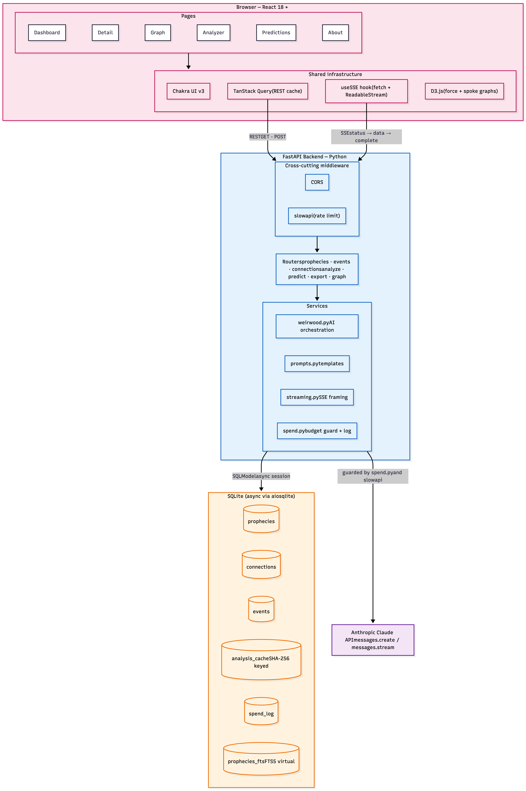
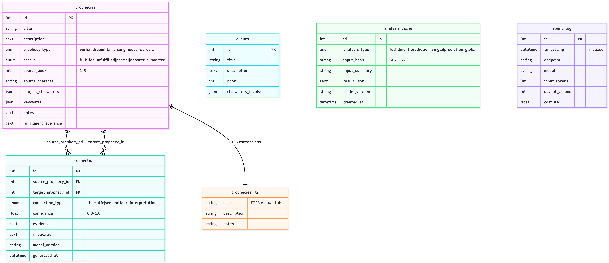

# Architecture — Weirwood.net

## System Overview




### Request flow at a glance


1. Browser fires **REST** for list/detail reads (cached by TanStack Query) or **SSE POST** for AI endpoints
2. FastAPI middleware chain — CORS → slowapi (throttle) — before hitting the router
3. Router delegates to `services/weirwood.py`; before any Claude call, `spend.py` checks the daily USD cap; after, it records token usage
4. Results stream back to the browser one SSE event at a time, while also being persisted to `analysis_cache` so future requests replay instantly

## Data Model




| Table | Purpose | Key Fields |
|-------|---------|-----------|
| `prophecies` | Core prophecy entries | title, description, type, status, source_book, subject_characters (JSON), keywords (JSON) |
| `connections` | AI-generated links between prophecies | source_prophecy_id, target_prophecy_id, connection_type, confidence, evidence |
| `events` | Pre-seeded canonical events for fulfillment analyzer | title, description, book, characters_involved (JSON) |
| `analysis_cache` | Cached AI analysis results | analysis_type, input_hash (SHA-256), result_json |
| `prophecies_fts` | FTS5 virtual table for full-text search | title, description, notes (indexed) |

## API Endpoints

| Method | Path | Type | Description |
|--------|------|------|-------------|
| GET | /health | REST | Health check |
| GET | /api/v1/prophecies | REST | List with filtering, sorting, pagination |
| GET | /api/v1/prophecies/{id} | REST | Detail with connections |
| GET | /api/v1/events | REST | All pre-seeded events |
| GET | /api/v1/prophecies/{id}/connections | REST | Cached connections |
| POST | /api/v1/prophecies/{id}/connections/generate | SSE | AI connection discovery |
| POST | /api/v1/analyze/fulfillment | SSE | Event-to-prophecy matching |
| POST | /api/v1/predict/prophecy/{id} | SSE | Per-prophecy TWOW prediction |
| POST | /api/v1/predict/global | SSE | Global TWOW report |
| GET | /api/v1/export/prophecy/{id} | File | Markdown download |
| GET | /api/v1/graph | REST | Graph nodes + edges |

## Key Architecture Decisions

1. **SQLite** — Dataset is ~75 prophecies, read-heavy, single-user. Eliminates external DB process.
2. **SSE over WebSockets** — Unidirectional streaming (server → client). Simpler, auto-reconnects.
3. **Non-streaming AI + SSE** — Complete JSON from Claude for validation, progressive SSE delivery.
4. **Token streaming for prose** — TWOW predictions use `client.messages.stream()` for real-time text.
5. **D3 direct** — No wrapper library. Full control over force simulation, zoom, drag.
6. **FTS5** — SQLite's built-in full-text search. No external search service.
7. **Analysis caching** — SHA-256 hash deduplication. Repeat requests return instantly.

## SSE Event Protocol

All AI endpoints follow: `status` → N × data events → `complete` or `error`.

```
event: status
data: {"message": "Analyzing..."}

event: connection|match|chunk
data: {... result data ...}

event: complete
data: {"total": N, "cached": false}
```
